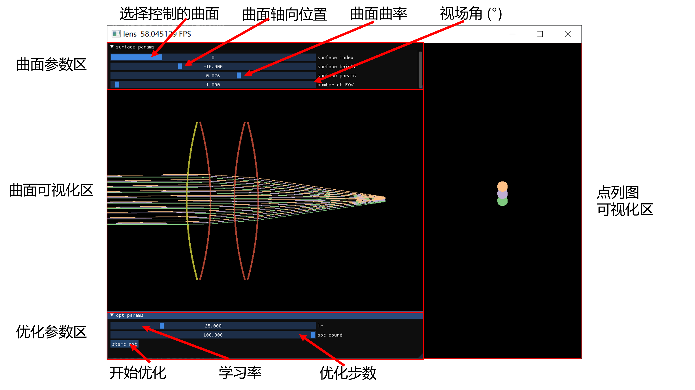

# diffLen-taichi

lens design with diffrentiable ray tracing using taichi lang.

## using method

1. create your python env and activate it:

   ``` bash
    conda create -n difflen python=3.8
   ```

    after creation finished, run:

    ``` bash
    conda activate difflen
    ```

2. install requirement package

    ``` bash
    pip install -r requirements.txt
    ```

3. run `python main.py`

## Introduction for gui



## demo


